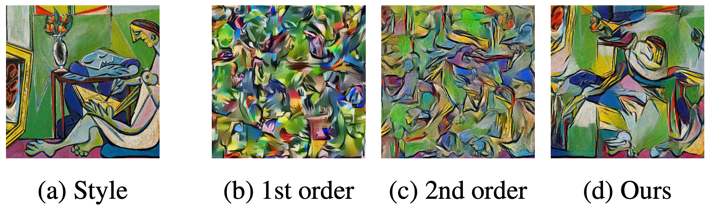

## About
Performs style transfer by using a neural network to discriminate between the style image features and the generated image features. Results yield higher quality transfers than contemporary methods. 

## Style representation comparions


## Example usage
See the `main.py` for all argument options.

#### Style transfer
```python
python main.py --distance=disc-sn --style=imgs/la_muse.jpg --content=imgs/golden_gate.jpg --device=cuda
```
Runs style transfer using the spectral norm discriminator from SNGAN to discriminate between the features. 
The style image and content images are the La Muse painting and a picture of the golden gate bridge respectively. 
Training is run on a GPU.

#### Style representation
```python
python main.py --distance=disc-sn --style=imgs/starry_night.jpg --device=cuda
```
Creates the style representation of the Starry Night painting using the spectral norm discriminator from SNGAN to discriminate between the features.
Training is run on a GPU.

## Style distances
The code supports different types of style distances:
> MMD stands for Maximum Mean Discrepancy
* `disc-sn`: Binary cross entropy using the spectral norm discriminator from SNGAN
* `disc-wass`: Wasserstein distance implemented using WGAN-GP
* `quad`: MMD with the quadratic kernel
* `linear`: MMD with the linear kernel
* `gauss`: MMD with the Gaussian kernel
* `norm`: Square error between 1st order statistics, mean and standard deviation
* `gram`: Square error between the gramian matrices. This is the original method of NST by Gatys et. al.

## Abstract
Neural style transfer (NST) is a powerful image generation technique that uses a convolutional neural network (CNN) to merge the content of one image with the style of another. Contemporary methods of NST use first or second order statistics of the CNN's features to achieve transfers with relatively little computational cost. However, these methods cannot fully extract the style from the CNN's features. We present a new algorithm for style transfer that fully extracts the style from the features by redefining the style loss as the Wasserstein distance between the distribution of features. Thus, we set a new standard in style transfer quality. In addition, we state two important interpretations of NST. The first is a re-emphasis from Li et al., which states that style is simply the distribution of features. The second states that NST is a type of generative adversarial network (GAN) problem.

## Paper
Huang, Eddie and Sahil Gupta. “Style is a Distribution of Features.” (2020).

[Arxiv](https://arxiv.org/abs/2007.13010)

If you find this code useful in your research, please consider citing:
```
@article{huang2020style,
  title={Style is a Distribution of Features},
  author={Huang, Eddie and Gupta, Sahil},
  journal={arXiv preprint arXiv:2007.13010},
  year={2020}
}
```

# Requirements
This code uses Python 3

### Required packages
* PyTorch
* Numpy
* Matplotlib
* Pillow
* TQDM
